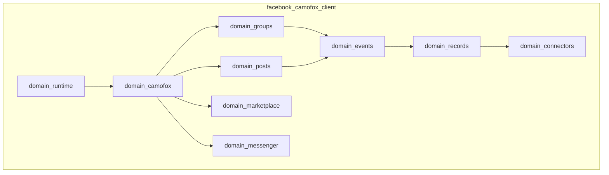

# OKF Architecture Overview: facebook-camofox-client
## Framework: OKF-DOG (Deterministic, Observable, Grounded)

This repository defines the client library and domain primitives for the **Camofox Facebook Client** monorepo integration.

---

## 1. Domain Architecture (DDD Structure)



---

## 2. Directory Layout & Primitives

```
facebook-camofox-client/
├── docs/
│   └── okf/
│       ├── architecture/
│       │   └── overview.md
│       ├── domains/
│       └── primitives/
├── src/
│   └── facebook_camofox_client/
│       ├── domain_accounts/      # Account state & session management
│       ├── domain_actions/       # Action dispatchers & rate-limit guards
│       ├── domain_camofox/      # Camofox anti-detect browser driver
│       ├── domain_connectors/   # OpenMagpie Source/Sink connectors
│       ├── domain_cursors/      # High-watermark pagination cursors
│       ├── domain_events/       # Canonical payload events
│       ├── domain_groups/       # Facebook group search & post extraction
│       ├── domain_marketplace/  # Marketplace listing observers
│       ├── domain_messenger/    # Direct message event streams
│       ├── domain_posts/        # Feed & wall post observers
│       ├── domain_records/      # Event persistence & ledger schemas
│       └── domain_runtime/      # Process lifecycle & execution context
├── tests/
│   └── domain_groups/
├── pyproject.toml
└── README.md
```

---

## 3. OKF-DOG Operational Guarantees

### D - Deterministic
- **Schema Contracts:** All payload schemas enforce Pydantic V2 validation with strict type bounds.
- **Fixed Selectors:** Selector strategies fall back gracefully across desktop, mobile (`m.facebook.com`), and basic HTML rendering nodes.

### O - Observable
- **Event Audit Logs:** Every DOM navigation and post extraction emits an observable trace event with timestamp, DOM selector key, and record count.

### G - Grounded
- **No Inferred States:** Unparsed or ambiguous Facebook DOM structures return explicit `None` / `UnparsedPayload` objects rather than throwing silent exceptions or fabricating data.
